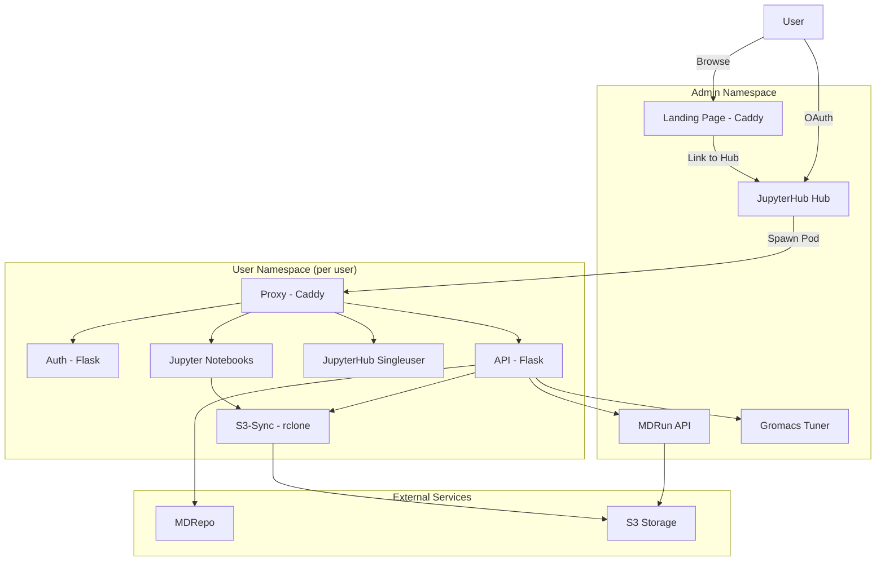
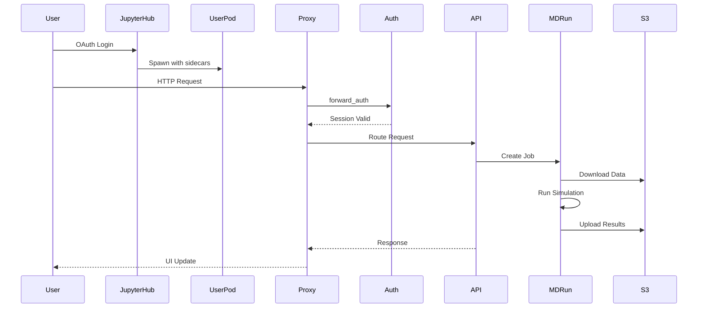

# MDDash - Molecular Dynamics Dashboard

## Mission Statement

Multi-tenant JupyterHub-based platform for molecular dynamics simulations that orchestrates GROMACS and AMBER jobs, provides wizard-driven experiment workflows, and integrates with external services (MDRepo, S3, Gromacs Tuner) through isolated user namespaces with sidecar containers.

## Architecture & Patterns

### High-Level Architecture

The system follows a **multi-namespace isolation pattern** where each user receives a dedicated Kubernetes namespace with resource quotas managed via Rancher project annotations. JupyterHub serves as the orchestration platform, spawning isolated user pods with sidecar containers for different services.



**Note**: The Proxy container serves the complete static UI (compiled React/TypeScript dashboard) embedded as static assets within the proxy container image. The JupyterHub Singleuser service is configured in `values.yaml.tmpl` to communicate with JupyterHub Hub and is proxied by the Proxy container.

### Core Patterns Across Components

| Pattern | Components Using It | Purpose |
|---------|-------------------|---------|
| **Sidecar Container Pattern** | All user pods | Proxy, Auth, API, S3-Sync run alongside JupyterHub Singleuser |
| **Pre-Spawn Hook Pattern** | JupyterHub | Dynamically provisions user infrastructure before notebook startup |
| **Active Record Pattern** | Dashboard API, MDRun API | Models encapsulate data persistence and orchestration logic |
| **CronJob Polling Pattern** | MDRun API | Scheduled one-shot Kubernetes CronJob queries job status and updates SQLite |
| **TanStack Query Pattern** | Dashboard UI | Server state management via custom hooks with automatic polling |
| **Repository Pattern** | Dashboard UI, Dashboard API | Centralized API clients with consistent error handling |
| **Template-Based Configuration** | Helm Charts | gomplate/Go templates rendered for environment-specific deployments |

## Core Dependencies

| Category | Libraries/Tools | Purpose |
|----------|----------------|---------|
| **Orchestration** | JupyterHub (4.2.0), Helm, Kubernetes | Multi-tenant platform, deployment, resource management |
| **Backend APIs** | Flask, SQLAlchemy, Marshmallow, Kubernetes Python Client | REST APIs, ORM, serialization, K8s orchestration |
| **Frontend** | React, ShadCN UI (radix-ui), Tailwind v4, TanStack Router, TanStack Query, Axios, MolStar | UI framework, components, styling, routing, server state, HTTP client, 3D visualization |
| **Infrastructure** | Caddy, rclone, Ray (Gromacs Tuner) | Reverse proxy, S3 sync, distributed computing |
| **External Services** | MDRepo, S3-compatible storage | Experiment publishing, persistent storage |

## Data Flow



## The "Gotchas" (Cross-Component)

### Configuration Management
- **Environment Detection**: Branch determines environment (`dev` → dev, `master` → prod). Tagging: dev uses static `dev` tag, prod uses `<short-sha>` format.
- **Values Template Rendering**: `helm/charts/mddash/values.yaml.tmpl` must be rendered with `gomplate` before Helm operations. Use `make -C helm render`. Never edit `values.yaml` directly—it's generated.
- **Runtime Config Injection**: UI receives runtime configuration via `window.MDDASH_CONFIG` object injected by Caddy proxy at `{$CADDY_ROUTE_PREFIX}/dash/config.js`. Dev mode detected when this is undefined.

### Authentication Flow
- **JupyterHub OAuth**: All authentication flows through JupyterHub's OAuth2 system.
- **Session Management**: Auth service uses in-memory session store (1-hour lifetime) with HMAC-signed state validation.
- **Forward Auth**: Caddy proxy uses `forward_auth` directive to validate sessions via auth container before routing to API or UI.
- **MDRepo OAuth**: Separate OAuth flow managed by Dashboard API with tokens stored in Flask session (not database).

### Kubernetes Integration
- **In-cluster Config Only**: Dashboard API, MDRun API, and the pre_spawn_hook all use `config.load_incluster_config()`. The hub pod's service account requires the ClusterRole defined in `helm/rbac/` to be applied by the cluster admin.
- **Shared PVC**: All containers in user pod mount `/mddash` directory to a persistent volume for user data.
- **Non-root Containers**: All containers run as UID 1000 with security context for e-INFRA compliance.
- **Rancher-Specific Annotations**: User namespaces require `field.cattle.io/projectId` and `field.cattle.io/resourceQuota` annotations. Pre-spawn hook waits for `InitialRolesPopulated`, patches the namespace, then waits for the ResourceQuota status to become active.
- **Binder Repository Support**: Notebook image automatically detects and installs Binder-compatible repositories (`environment.yml`, `requirements.txt`, `postBuild`). Conda environments are created at `/mddash/{experiment_id}/.binder-env` on the PVC for persistence across pod restarts.

### Database & Migrations
- **Dashboard API**: Runs `flask_migrate.upgrade()` on startup against versioned migrations in `dashboard/api/migrations/versions/` (source-controlled). Fallback to `db.create_all()` if migration fails. Add a new migration file when adding columns — do NOT manually run `flask db upgrade`.
- **MDRun API**: Uses `db.create_all()` only — no Alembic migrations.
- **SQLite WAL Mode**: MDRun API uses Write-Ahead Logging for concurrent reads/writes.

### Deployment Pipeline
- **Make-based Orchestration**: Root `Makefile` orchestrates build, test, push, and deploy across all components.
- **Helm Dependency Management**: Use `make -C helm update` to update Helm dependencies before deployment.
- **Image Tagging Strategy**: Dev uses static `dev` tags and prod uses immutable `<short-sha>` tags. Pull policy is per component/config: sidecars use `Always` in dev and `IfNotPresent` in prod, while some services such as Gromacs Tuner and the rendered `mdrun-api` subchart use `Always`.
- **Secrets Management**: All secrets created in namespace during deployment via GitHub Actions CI/CD.

### Error Handling
- **RESTful API Responses**: Dashboard API routes return raw resources via `jsonify()` on success and raise `HTTPException` (`BadRequest`, `NotFound`, etc.) for errors. `@handle_exceptions` catches exceptions and returns `{detail: "..."}` with the correct HTTP status code.
- **Decorator Pattern**: Use `@handle_exceptions()` decorator on Dashboard API JSON route handlers. Set `rollback=True` for routes that modify database.
- **Graceful Degradation**: Missing environment variables log warnings but don't crash.

## Entry Points

### Project-Level Entry Points
| File | Purpose | Key Commands |
|------|---------|--------------|
| `Makefile` | Build, test, deploy orchestration | `make build`, `make push`, `make deploy`, `make test` |
| `config.yaml` | Production environment configuration | All environment-specific settings |
| `config.dev.yaml` | Development environment configuration | Dev-specific settings |
| `config.edc.yaml` | EDC/EGI CheckIn environment configuration | EDC-specific settings |
| `README.md` | Project documentation | CI/CD setup, manual deployment, architecture overview |

### Component Entry Points (See Component AGENTS.md for Details)

| Component | Location | AGENTS.md | Purpose |
|-----------|----------|-----------|---------|
| **Dashboard API** | `dashboard/api/` | `dashboard/api/AGENTS.md` | Flask REST API for experiment management |
| **Dashboard UI** | `dashboard/ui/` | `dashboard/ui/AGENTS.md` | React-based wizard interface (static files embedded in proxy container) |
| **Dashboard Auth** | `dashboard/auth/` | See `dashboard/auth/auth.py` | OAuth flow and session management |
| **Dashboard Proxy** | `dashboard/proxy/` | See `dashboard/proxy/Caddyfile` | Caddy reverse proxy, static UI serving, routes to JupyterHub Singleuser |
| **Dashboard S3-Sync** | `dashboard/s3-sync/` | See `dashboard/s3-sync/sync.sh` | Bidirectional S3 synchronization |
| **MDRun API** | `mdrun-api/` | `mdrun-api/AGENTS.md` | GROMACS and AMBER job management API |
| **Landing Page** | `landing/` | `landing/AGENTS.md` | Public landing page served at root path |
| **Helm Charts** | `helm/charts/mddash/` | `helm/charts/mddash/AGENTS.md` | Multi-tenant JupyterHub deployment |

### Key Application Entry Points

**Dashboard API:**
- `dashboard/api/app.py` - Flask application factory
- `dashboard/api/routes/__init__.py` - Blueprint registration

**Dashboard UI:**
- `dashboard/ui/src/Main.tsx` - Application root with routing
- `dashboard/ui/src/lib/http.ts` - Centralized API client

**MDRun API:**
- `mdrun-api/app.py` - Flask application factory
- `mdrun-api/routes.py` - API endpoints

**Landing Page:**
- `landing/src/main.tsx` - React entry point
- `landing/vite.config.ts` - Build configuration with single-file plugin

**Helm Charts:**
- `helm/charts/mddash/values.yaml.tmpl` - Configuration template (includes JupyterHub Singleuser configuration)
- `helm/charts/mddash/files/pre_spawn_hook.py` - User namespace provisioning

## Development Workflow

1. **Local Development**: Use `make demo` to run the real Flask API through `dashboard/api/_demo/app.py` (test-style mocks + seeded data) + React dev server locally
2. **Testing**: Run `make test` to execute all component tests
3. **Building**: Run `make build ENV=dev` or `make build ENV=prod` to build all images
4. **Deployment**: Run `make deploy ENV=dev` or `make deploy ENV=prod` to deploy via Helm
5. **Rollback**: Run `make rollback ENV=prod REVISION=N` to rollback to specific revision

## Feedback Loop

Run from repo root before claiming any Python code is correct. Each command must pass before moving to the next.

```bash
make format
make type-check
make test
```

## CI/CD Pipeline

- **`ci.yml`**: Runs on every PR and push. Lint, test, type-check. No Docker builds or deployments.
- **`cd.yml`**: Runs only on push to `dev` or `master`. Change detection via `dorny/paths-filter@v4`; dev builds only changed components, prod builds all components when any tracked deploy path changed; deploys via Helm only when tracked deploy paths changed; verifies with lightweight health check.
- **`codeql.yml`**: Runs CodeQL for GitHub Actions, JavaScript/TypeScript, and Python on `master` pushes, `master` PRs, and a weekly schedule.
- **Image Tags**: Dev uses `dev`, prod uses `<short-sha>`.
- **Secrets**: Automatically created in namespace during deployment
- **Image Retention**: Harbor retention policy configured per environment
