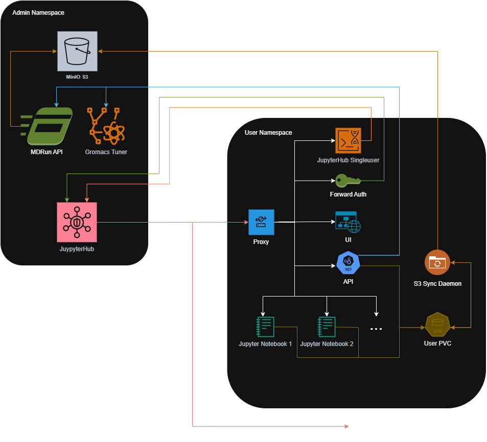

# MDDash

Molecular Dynamics simulation dashboard with JupyterHub integration.


## CI/CD Setup

1. **Add GitHub secrets** (Settings → Secrets):
   - `REGISTRY_USERNAME` - Container registry user
   - `REGISTRY_PASSWORD` - Container registry password  
   - `KUBECONFIG` - Your kubeconfig base64 encoded: `cat ~/.kube/config | base64 -w 0`
   - `OAUTH_CLIENT_ID` - OAuth client ID for authentication
   - `OAUTH_CLIENT_SECRET` - OAuth client secret
   - `MINIO_ROOT_USER` - MinIO root username (default: `minio`)
   - `MINIO_ROOT_PASSWORD` - MinIO root password (use a strong password in production!)

2. **Push to deploy**:
   - Push to `dev` → deploys to dev environment
   - Push to `master` → deploys to production

All secrets are automatically created in the namespace during deployment.


## Configuration

- `config.yaml` - Production environment configuration
- `config.dev.yaml` - Development environment configuration


## Development Setup

### Dev Container

Install the *Dev Containers* extension in VSCode, then `F1` → *"Reopen in Container"*. Includes Docker-in-Docker, kubectl, and all dev tools.


## Local Commands

```bash
make build ENV=dev    # Build images
make all ENV=dev      # Build, push, deploy
make status ENV=dev   # Check status
make help             # Show all commands
```


## Manual Deployment

If you need to deploy manually (bypassing CI/CD), follow these steps.

### 1. Prerequisites

Ensure you have the following tools installed:
- `docker`
- `kubectl`
- `helm`
- `yq`
- `gomplate`
- `make`

### 2. Environment Setup

Choose your target environment (`dev` or `prod`):

```bash
export ENV=dev  # or prod
```

### 3. Create Secrets

You must manually create the required Kubernetes secrets in your target namespace.

First, get the namespace and package name from your config:
```bash
NAMESPACE=$(yq '.namespace' config.${ENV}.yaml)
PACKAGE=$(yq '.helm.package' config.${ENV}.yaml)
kubectl create namespace ${NAMESPACE} --dry-run=client -o yaml | kubectl apply -f -
```

Then create the secrets (replace placeholders with actual values):

```bash
# OAuth Credentials
kubectl create secret generic oidc-credentials \
  --from-literal=client_id="YOUR_CLIENT_ID" \
  --from-literal=client_secret="YOUR_CLIENT_SECRET" \
  -n ${NAMESPACE}

# Kubeconfig for the cluster (used by the app to spawn resources)
kubectl create secret generic ${PACKAGE}-kubeconfig-secret \
  --from-file=config=$HOME/.kube/config \
  -n ${NAMESPACE}

# S3/MinIO Credentials
kubectl create secret generic ${PACKAGE}-s3-creds \
  --from-literal=S3_ACCESS_KEY="YOUR_MINIO_ROOT_USER" \
  --from-literal=S3_SECRET_KEY="YOUR_MINIO_ROOT_PASSWORD" \
  -n ${NAMESPACE}

# MinIO Root Config (required for MinIO tenant)
kubectl create secret generic minio-root-config \
  --from-literal=config.env="export MINIO_ROOT_USER=\"YOUR_MINIO_ROOT_USER\"
export MINIO_ROOT_PASSWORD=\"YOUR_MINIO_ROOT_PASSWORD\"" \
  -n ${NAMESPACE}
```

### 4. Build and Deploy

Once secrets are in place, you can run the full deployment pipeline:

```bash
# 1. Build and push all docker images
make push ENV=${ENV}

# 2. Package and push the mdrun-api Helm chart (sub-chart for mddash)
make push-mdrun-api-chart ENV=${ENV}

# 3. Deploy to Kubernetes
# For first-time installation:
make -C helm install ENV=${ENV}

# For updates:
make deploy ENV=${ENV}
```


## App Architecture



### Admin Namespace
Shared infrastructure components that manage the platform and compute resources.

- **JupyterHub**
  - *Location*: Configured in `helm/charts/mddash/values.yaml.tmpl`
  - *Purpose*: Orchestrates the platform by managing user logins and spawning isolated environments for each user on demand.
- **MDRun API**
  - *Location*: `mdrun-api/`, `helm/charts/mdrun-api` (Configured in `helm/charts/mddash/values.yaml.tmpl`)
  - *Purpose*: Decouples simulation execution from user sessions, ensuring long-running GROMACS jobs continue even if the user logs out.
- **MinIO S3**
  - *Location*: Configured in `helm/charts/mddash/values.yaml.tmpl`
  - *Purpose*: Provides a central, scalable storage layer accessible by all services to persist large simulation datasets and trajectories.
- **Gromacs Tuner**
  - *Location*: [source code](https://github.com/CERIT-SC/gromacs-tuner) (Configured in `helm/charts/mddash/values.yaml.tmpl`)
  - *Purpose*: Automatically benchmarks and selects the most efficient simulation parameters to optimize performance and resource usage.

### User Namespace
Isolated environments created for each logged-in user.

- **Proxy (Caddy)**
  - *Location*: `dashboard/proxy/`
  - *Port*: `8888`, `2019` (proxy admin)
  - *Purpose*: Acts as the single entry point for the user pod, routing traffic to the appropriate internal service (UI, API, or Jupyter) and serving the frontend application.
- **JupyterHub Singleuser**
  - *Location*: Configured in `helm/charts/mddash/values.yaml.tmpl`
  - *Port*: `8080`
  - *Purpose*: Provides the standard interface required by JupyterHub to manage the pod's lifecycle and connectivity.
- **Forward Auth**
  - *Location*: `dashboard/auth/`
  - *Port*: `5001`
  - *Purpose*: Secures the application by intercepting requests and validating JupyterHub authentication tokens before they reach the API or UI.
- **UI**
  - *Location*: `dashboard/ui/`
  - *Purpose*: Simplifies the complex workflow of molecular dynamics by providing a graphical interface for experiment setup and monitoring.
- **API**
  - *Location*: `dashboard/api/`
  - *Port*: `5000`
  - *Purpose*: Centralizes business logic to manage experiment state and coordinate actions between the user interface and backend simulation services.
- **S3 Sync Daemon**
  - *Location*: `dashboard/s3-sync/`
  - *Purpose*: Bridges the gap between local file access and cloud storage by automatically syncing user data to MinIO for persistence and sharing.
- **Jupyter Notebooks**
  - *Location*: `notebook/`
  - *Purpose*: Offers an interactive environment for specific setup tasks (like protein preparation) that require manual visualization or intervention.
- **User PVC**
  - *Location*: Configured in `helm/charts/mddash/pre_spawn_hook.py`
  - *Purpose*: Mounts the `/mddash` directory to a persistent volume, ensuring user data and configurations persist across sessions.
