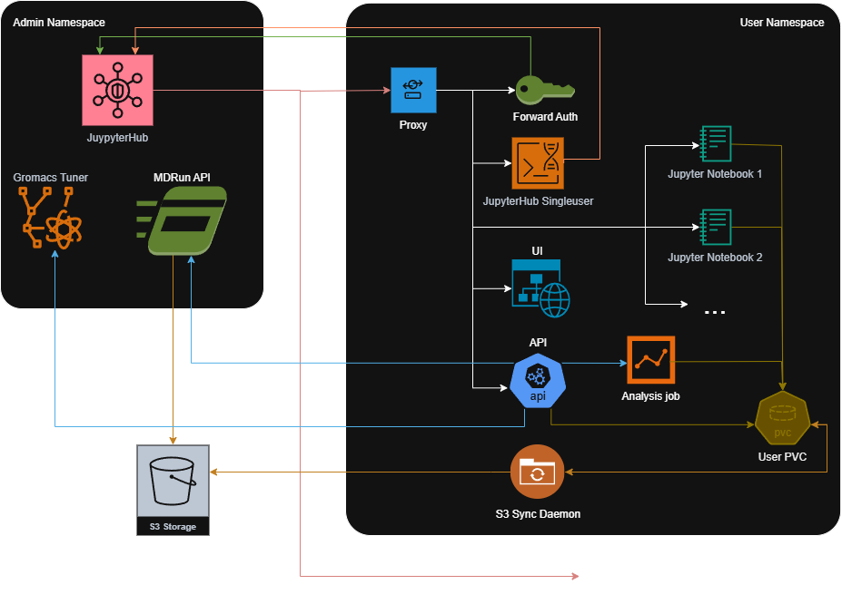

# MDDash - one stop shop for MD simulations

1. Download from PDB, upload your files, *download from MDDB, or clone git repo (coming soon)*
2. Run arbitrary simulation setup protocol in Jupyter notebook to record provenance
3. Tune computation setup (MPI jobs, OMP cores, GPU assignment) for the best performance
4. Run production simulation
5. Analyze and visualize results
6. Publish results to MDDB *(still to be elaborated)*

**Wanna try?** 
- contact us, we need lightweight registration to make sure the precious hardware funded by our authorities is used according to AUP
- go to https://mddash.dyn.cloud.e-infra.cz/

## References

- Krása, F., Rošinec, A., Ondrejka, A., & Křenek, A. MDDash – one stop shop for MD simulations. MDDB Conference, Lausanne, 2026. https://doi.org/10.5281/zenodo.18740266

## CI/CD Setup

1. **Add GitHub secrets** (Settings → Secrets):
   - `REGISTRY_USERNAME` - Container registry user
   - `REGISTRY_PASSWORD` - Container registry password  
   - `KUBECONFIG` - Your kubeconfig base64 encoded: `cat ~/.kube/config | base64 -w 0`
   - `OAUTH_CLIENT_ID` - OAuth client ID for authentication
   - `OAUTH_CLIENT_SECRET` - OAuth client secret
   - `S3_ACCESS_KEY` - S3 access key
   - `S3_SECRET_KEY` - S3 secret key
   - `MDREPO_CLIENT_ID` - MDRepo OAuth client ID for publishing experiments
   - `MDREPO_CLIENT_SECRET` - MDRepo OAuth client secret
   - `TUNER_USER` - Username for Gromacs Tuner
   - `TUNER_PASSWORD` - Password for Gromacs Tuner

2. **Push to deploy**:
   - Push to `dev` → deploys to dev environment when application, Helm, or config paths changed (tag: `dev`)
   - Push to `master` → deploys to production when application, Helm, or config paths changed (tag: `<short-sha>`)

All secrets are automatically created in the namespace during deployment.
CodeQL security scanning runs separately for `master` pushes, `master` pull requests, and the weekly scheduled scan.


## Image Tagging Strategy

| Environment | Branch   | Tag Format        | Sidecar Pull Policy |
| ----------- | -------- | ----------------- | ------------------- |
| **Dev**     | `dev`    | Static `dev`      | `Always`            |
| **Prod**    | `master` | `<short-sha>`     | `IfNotPresent`      |

Other services can override this policy in configuration; for example, Gromacs Tuner uses `Always`, and the rendered `mdrun-api` subchart currently uses `Always`.

### Harbor Retention Policy

Configure in Harbor UI (Project → Policy → Tag Retention):
1. **Dev tags**: Repository `**`, tag `dev` → Retain always
2. **Prod tags**: Repository `**`, tag matching commit SHA pattern → Keep last 10 pushed


## Configuration

- `config.yaml` - Production environment configuration
- `config.dev.yaml` - Development environment configuration
- `config.edc.yaml` - EDC/EGI CheckIn environment configuration


## Development Setup

### Dev Container

Install the *Dev Containers* extension in VSCode, then `F1` → *"Reopen in Container"*. Includes Docker-in-Docker, kubectl, and all dev tools.

### Local Demo

Run the dashboard locally with the real Flask API, deterministic demo data, mocked external integrations, and the React dev server:

```bash
make demo
```


## Local Commands

```bash
make build ENV=dev    # Build images
make push ENV=dev     # Build and push images
make all ENV=dev      # Build, push images, and deploy (does not push Helm chart packages)
make format           # Format Python and UI code
make lint             # Check Python linting
make type-check       # Type-check Python components and UI
make test             # Run Python test suites
make status ENV=dev   # Check status
make history ENV=prod # Show deployment history
make rollback ENV=prod REVISION=3  # Rollback to specific revision
make help             # Show all commands
```

Local commands expect `uv` for Python workflows and `pnpm` for the UI unless you are using the dev container.


## Manual Deployment

If you need to deploy manually (bypassing CI/CD), follow these steps.

### 1. Prerequisites

Ensure you have the following tools installed (all are installed if using the dev container):
- `docker`
- `kubectl`
- `helm`
- `yq`
- `gomplate`
- `uv`
- `pnpm`
- `make`

### 2. Environment Setup

Choose your target environment and matching config file:

```bash
export ENV=dev  # or prod, edc, ...

# Use config.yaml for prod, config.dev.yaml for dev, config.edc.yaml for edc, etc.
export CONFIG=config.dev.yaml

export NAMESPACE=$(yq '.namespace' "${CONFIG}")
export PACKAGE=$(yq '.helm.package' "${CONFIG}")
```

### 3. Bootstrap Kubernetes Resources

Create the target namespace, apply the hub service account RBAC, and create the required Kubernetes secrets.

```bash
kubectl get namespace "${NAMESPACE}" >/dev/null 2>&1 || kubectl create namespace "${NAMESPACE}"
```

Apply the cluster-wide RBAC once as a cluster admin:

```bash
# Hub service account RBAC (applied once by cluster admin; see helm/rbac/ for details)
# Replace <NAMESPACE> in helm/rbac/clusterrole.yaml first.
kubectl apply -f helm/rbac/clusterrole.yaml

# Rancher clusters also need project namespace-management RBAC.
# Replace <NAMESPACE> and <PROJECT_ID> first. <PROJECT_ID> is the short Rancher
# project suffix without the leading "p-"; for c-m-qvndqhf6:p-hshk2 use hshk2.
kubectl apply -f helm/rbac/rancher-clusterrole.yaml
```

Create the secrets, replacing placeholders with actual values:

```bash
# OAuth Credentials
kubectl create secret generic oidc-credentials \
  --from-literal=client_id="YOUR_CLIENT_ID" \
  --from-literal=client_secret="YOUR_CLIENT_SECRET" \
  -n ${NAMESPACE} --dry-run=client -o yaml | kubectl apply -f -

# S3 Credentials
kubectl create secret generic ${PACKAGE}-s3-creds \
  --from-literal=S3_ACCESS_KEY="YOUR_S3_ACCESS_KEY" \
  --from-literal=S3_SECRET_KEY="YOUR_S3_SECRET_KEY" \
  -n ${NAMESPACE} --dry-run=client -o yaml | kubectl apply -f -

# MDRepo OAuth Credentials (for publishing experiments to MDRepo)
kubectl create secret generic ${PACKAGE}-mdrepo-credentials \
  --from-literal=client_id="YOUR_MDREPO_CLIENT_ID" \
  --from-literal=client_secret="YOUR_MDREPO_CLIENT_SECRET" \
  -n ${NAMESPACE} --dry-run=client -o yaml | kubectl apply -f -

# Gromacs Tuner Credentials
kubectl create secret generic tuner-auth \
  --from-literal=user="YOUR_TUNER_USER" \
  --from-literal=password="YOUR_TUNER_PASSWORD" \
  -n ${NAMESPACE} --dry-run=client -o yaml | kubectl apply -f -
```

### 4. Build and Deploy

Once secrets are in place, you can run the full deployment pipeline:

```bash
# 1. Authenticate to the container and Helm OCI registry.
# Use the registry host from the selected config, for example cerit.io.
docker login <registry-host>
helm registry login <registry-host>

# 2. Build and push all docker images
make push ENV=${ENV}

# 3. Package and push the mdrun-api Helm chart when the subchart changed.
# The parent chart currently pulls this dependency from oci://cerit.io/xkrasa;
# for non-xkrasa registries, update the dependency repository before relying on this push.
make push-mdrun-api-chart ENV=${ENV}

# 4. Update Helm dependencies when charts or config changed
make -C helm update ENV=${ENV}

# 5. Deploy to Kubernetes
# For first-time installation:
make -C helm install ENV=${ENV}

# For updates:
make deploy ENV=${ENV}
```


## App Architecture



### Admin Namespace
Shared infrastructure components that manage the platform and compute resources.

- **JupyterHub**
  - *Location*: Configured in `helm/charts/mddash/values.yaml.tmpl`
  - *Purpose*: Orchestrates the platform by managing user logins and spawning isolated environments for each user on demand.
- **MDRun API**
  - *Location*: `mdrun-api/`, `helm/charts/mdrun-api` (Configured in `helm/charts/mddash/values.yaml.tmpl`)
  - *Purpose*: Decouples simulation execution from user sessions, ensuring long-running GROMACS and AMBER jobs continue even if the user logs out.
- **Gromacs Tuner**
  - *Location*: [source code](https://github.com/CERIT-SC/gromacs-tuner) (Configured in `helm/charts/mddash/values.yaml.tmpl`)
  - *Purpose*: Automatically benchmarks and selects the most efficient simulation parameters to optimize performance and resource usage.

### User Namespace
Isolated environments created for each logged-in user.

- **Proxy (Caddy)**
  - *Location*: `dashboard/proxy/`
  - *Port*: `8888`, `2019` (proxy admin)
  - *Purpose*: Acts as the single entry point for the user pod, routing traffic to the appropriate internal service (UI, API, or Jupyter) and serving the frontend application.
- **JupyterHub Singleuser**
  - *Location*: Configured in `helm/charts/mddash/values.yaml.tmpl`
  - *Port*: `8080`
  - *Purpose*: Provides the standard interface required by JupyterHub to manage the pod's lifecycle and connectivity.
- **Forward Auth**
  - *Location*: `dashboard/auth/`
  - *Port*: `5001`
  - *Purpose*: Secures the application by intercepting requests and validating JupyterHub authentication tokens before they reach the API or UI.
- **UI**
  - *Location*: `dashboard/ui/`
  - *Purpose*: Simplifies the complex workflow of molecular dynamics by providing a graphical interface for experiment setup and monitoring.
- **API**
  - *Location*: `dashboard/api/`
  - *Port*: `5000`
  - *Purpose*: Centralizes business logic to manage experiment state and coordinate actions between the user interface and backend simulation services.
- **S3 Sync Daemon**
  - *Location*: `dashboard/s3-sync/`
  - *Purpose*: Bridges the gap between local file access and cloud storage by automatically syncing user data to S3 for persistence and sharing.
- **Analysis Job**
  - *Location*: Executed from `dashboard/api/models/analysis_job.py`
  - *Purpose*: Runs on-demand molecular workflow analysis jobs against experiment data.
- **Jupyter Notebooks**
  - *Location*: `notebook/`
  - *Purpose*: Offers an interactive environment for specific setup tasks (like protein preparation) that require manual visualization or intervention.
- **User PVC**
  - *Location*: Configured in `helm/charts/mddash/files/pre_spawn_hook.py`
  - *Purpose*: Mounts the `/mddash` directory to a persistent volume, ensuring user data and configurations persist across sessions.

### External Services
Services outside the Kubernetes cluster that the application depends on.

- **S3**
  - *Location*: Endpoint configured in `config*.yaml` (secrets stored in `${PACKAGE}-s3-creds`)
  - *Purpose*: Provides a central, scalable storage layer accessible by all services to persist large simulation datasets and trajectories.
