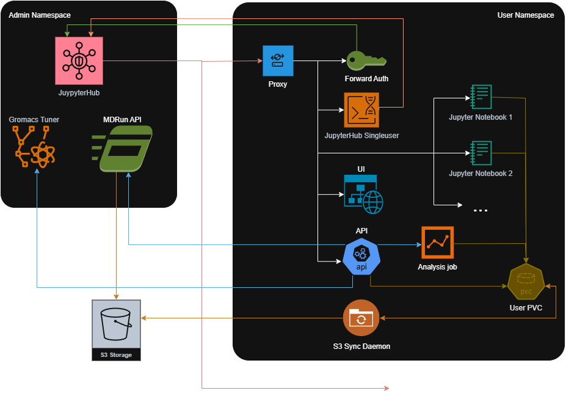

# MDDash - one stop shop for MD simulations

1. Download from PDB, upload your files, import by DOI, or clone a git workflow repo
2. Run arbitrary simulation setup protocol in Jupyter notebook to record provenance
3. Tune computation setup (MPI jobs, OMP cores, GPU assignment) for the best performance
4. Run production simulation
5. Analyze and visualize results
6. Publish results to MDRepo, or export to MDPosit

**Wanna try?** Contact us first. A lightweight registration makes sure the precious hardware funded by our authorities is used according to the AUP. Then go to https://mddash.cloud.e-infra.cz/.

User-facing documentation lives in [docs/guides/](docs/guides/).

## Architecture



Each user gets an isolated Kubernetes namespace; their pod runs sidecars (Caddy proxy, auth, dashboard API, S3 sync) next to Jupyter. The admin namespace runs JupyterHub, the MDRun API (runs GROMACS and AMBER jobs independently of user sessions), the Tuner, and the landing page. Full component inventory: [docs/architecture.md](docs/architecture.md).

## Development

```bash
make demo   # real Flask API, seeded demo data, mocked integrations, React dev server
```

Demo data is wiped and reseeded on every start.

For a full toolchain, use the dev container: install the *Dev Containers* VSCode extension, then `F1` → *"Reopen in Container"* (includes Docker-in-Docker, kubectl, and all dev tools). Outside the container, commands expect `uv` and `pnpm`.

Quality gates, run from the repo root. Each must pass before the next:

```bash
make fix              # auto-fix formatting and lint (Ruff, Prettier/Oxlint)
make type-check       # Python and TypeScript
make knip             # frontend dead code
make test             # all test suites
make e2e              # Playwright browser E2E tests
make validate-charts  # when editing Helm charts (requires helm + gomplate + yq)
make lint-workflows   # when editing GitHub Actions (requires actionlint + zizmor)
```

`make help` lists all commands.

## Deployment

- A push to `master` runs the CI quality gate, then deploys all images tagged `dev` to the dev environment.
- A `vMAJOR.MINOR.PATCH` tag (created via `make release VERSION=x.y.z`) runs CI, deploys immutable `MAJOR.MINOR.PATCH` images to production, and creates a GitHub Release.

Operator setup (GitHub secrets, Kubernetes bootstrap, manual deployment, registry policies, rollback notes): [docs/deployment.md](docs/deployment.md).

## References

- Krása, F., Rošinec, A., Ondrejka, A., & Křenek, A. MDDash - one stop shop for MD simulations. MDDB Conference, Lausanne, 2026. https://doi.org/10.5281/zenodo.18740266

### MDDash paper

```bib
@misc{mddash,
  AUTHOR = {Krása, Filip},
  TITLE = {Virtual Research Environment for Molecular Dynamics Simulation Experiments},
  YEAR = {2026},
  TYPE = {Bachelor's thesis},
  INSTITUTION = {Masaryk University, Faculty of Informatics},
  LOCATION = {Brno},
  SUPERVISOR = {Adrián Rošinec},
  URL = {https://is.muni.cz/th/wdhgd/},
  URL_DATE = {2026-05-24},
}
```
