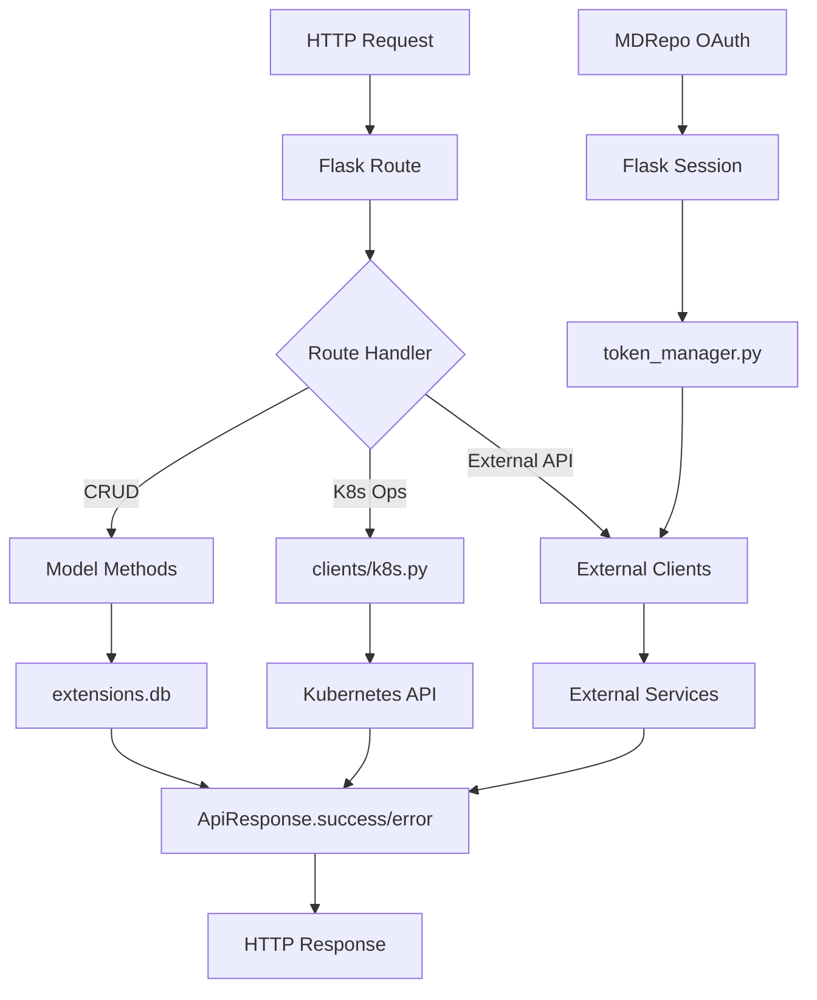

# MD Dash API

## Mission Statement

Flask-based REST API that orchestrates molecular dynamics experiments across Kubernetes, manages MDRepo OAuth authentication, and coordinates with external services (MDRun, Tuner).

## Architecture & Patterns

### Design Patterns
- **Blueprint Pattern**: Routes organized into modular Flask blueprints (`experiments_bp`, `notebook_bp`, `tuner_bp`, `gmx_bp`, `files_bp`, `misc_bp`, `mdrepo_bp`)
- **Active Record Pattern**: SQLAlchemy models encapsulate business logic (e.g., `Experiment.from_pdb()`, `Experiment.publish()`)
- **Schema Pattern**: Marshmallow schemas for serialization with `@pre_dump` hooks for side effects
- **Decorator Pattern**: `@handle_exceptions(rollback=True)` for consistent error handling and transaction management
- **Singleton Pattern**: Extensions (`db`, `ma`, `migrate`) initialized as singletons in `extensions.py`
- **Factory Pattern**: `create_app()` function for Flask application initialization

### Layer Organization
```
routes/ → models/ → clients/ → external services
   ↓         ↓          ↓
schemas ← extensions ← config
```

## Core Dependencies

| Library | Purpose | Critical Path |
|---------|---------|---------------|
| `flask` | Web framework | Core request handling |
| `flask-sqlalchemy` | ORM | Database persistence |
| `flask-marshmallow` | Serialization | API response formatting |
| `flask-migrate` | Database migrations | Schema evolution |
| `kubernetes` | Kubernetes API client | Pod/job orchestration |
| `requests` | HTTP client | External API calls (MDRun, Tuner, MDRepo) |
| `cachetools` | Caching | TTLCache for status checks |

## Data Flow



### Request Lifecycle
1. Request hits Flask route in `routes/`
2. Route handler calls model method or client function
3. Model/Client performs business logic (DB, K8s, external API)
4. Response wrapped in `ApiResponse.success()` or `ApiResponse.error()`
5. JSON response returned with consistent structure `{success, data/message}`

### Background Operations
- MDRepo file uploads run in daemon threads via `mdrepo.start_upload_worker()`
- No async framework used; threading for non-blocking operations

## The "Gotchas"

### Database Migrations
- **Auto-generated on startup**: `create_app()` automatically generates and runs migrations on every startup
- Fallback to `db.create_all()` if migration fails
- Migrations stored in `DATA_DIR/migrations` (not in source control)
- Do NOT manually run `flask db upgrade` - the app handles it

### Authentication & Sessions
- **MDRepo OAuth**: Tokens stored in Flask session, NOT database
- Use `MDRepoTokenManager(session).get_valid_token()` for authenticated requests
- Token refresh happens automatically with exponential backoff (3 retries)
- Session keys: `mdrepo_token`, `mdrepo_refresh_token`, `mdrepo_token_expires_at`

### Experiment IDs
- **5-character lowercase alphabetic strings** (e.g., `abcde`)
- Generated randomly via `get_unique_id()` - guaranteed unique within `DATA_DIR`
- Used as directory names and primary keys
- Validate with `check_experiment_id()` before use

### Kubernetes Resources
- **In-cluster config only**: `config.load_incluster_config()` called at module import
- All containers run as non-root (UID 1000) with security context
- Shared PVC mounted at `/mddash` for all pods/jobs
- Jobs have `backoffLimit: 0` (no retries on failure)
- Resource defaults: 50m CPU / 64Mi memory requests, 500m CPU / 256Mi memory limits

### File Operations
- **Git clones**: Shallow clones (`--depth 1`) without history, `.git` directory removed
- **Path validation**: Always use `check_path()` and `check_filename()` to prevent traversal
- **Excluded paths**: `.ipynb_checkpoints`, `__pycache__`, `*.edr`, `*.xtc`, `*.tpr`, `*.log`, etc.
- **Upload filtering**: `is_excluded_path()` filters files before MDRepo upload

### Error Handling
- **Always use `@handle_exceptions()` decorator** on route handlers
- Set `rollback=True` for routes that modify database
- `ApiResponse.error()` automatically logs exceptions
- HTTP exceptions (`BadRequest`, `NotFound`, etc.) are caught and converted to JSON responses

### Configuration
- All config loaded from environment variables in `config.py`
- `DATA_DIR` defaults to `/mddash` - all experiment data stored here
- `NAMESPACE` defaults to `default` but logs warning if not set
- Missing required env vars log warnings but don't crash (graceful degradation)

### Caching
- `step_status_cache`: 100ms TTL for experiment step calculations
- `mdrepo_status_cache`: 60s TTL for MDRepo publication status
- Cache keys include experiment ID for proper invalidation

## Entry Points

| File | Purpose | Key Functions |
|------|---------|---------------|
| `app.py` | Flask application factory | `create_app()` |
| `routes/__init__.py` | Blueprint registration | Imports all route blueprints |
| `config.py` | Environment configuration | All env var loading and validation |
| `extensions.py` | Extension initialization | `db`, `ma`, `migrate` singletons |

### Route Entry Points
- `routes/experiments.py` - Experiment CRUD operations
- `routes/notebook.py` - Jupyter notebook pod management
- `routes/tuner.py` - GROMACS tuner job orchestration
- `routes/gmx.py` - GROMACS simulation job management
- `routes/files.py` - File listing and download
- `routes/mdrepo.py` - MDRepo OAuth flow and callbacks
- `routes/misc.py` - Health check and metrics endpoints

### Model Entry Points
- `models/experiment.py` - Core experiment lifecycle (`from_pdb`, `from_repo`, `from_files`, `publish`, `delete`)
- `models/notebook.py` - Notebook pod lifecycle
- `models/gromacs_job.py` - GROMACS job lifecycle
- `models/tuner_job.py` - Tuner job lifecycle

### Client Entry Points
- `clients/k8s.py` - Kubernetes resource management (`create_notebook_pod`, `create_job`, `get_pod_status`)
- `clients/mdrepo.py` - MDRepo API client (`create_experiment`, `upload_file`, `check_experiment_status`)
- `clients/mdrun.py` - MDRun API client (`create_job`, `get_job`, `delete_job`)
- `clients/tuner.py` - Tuner API client
- `clients/caddy.py` - Caddy reverse proxy configuration
