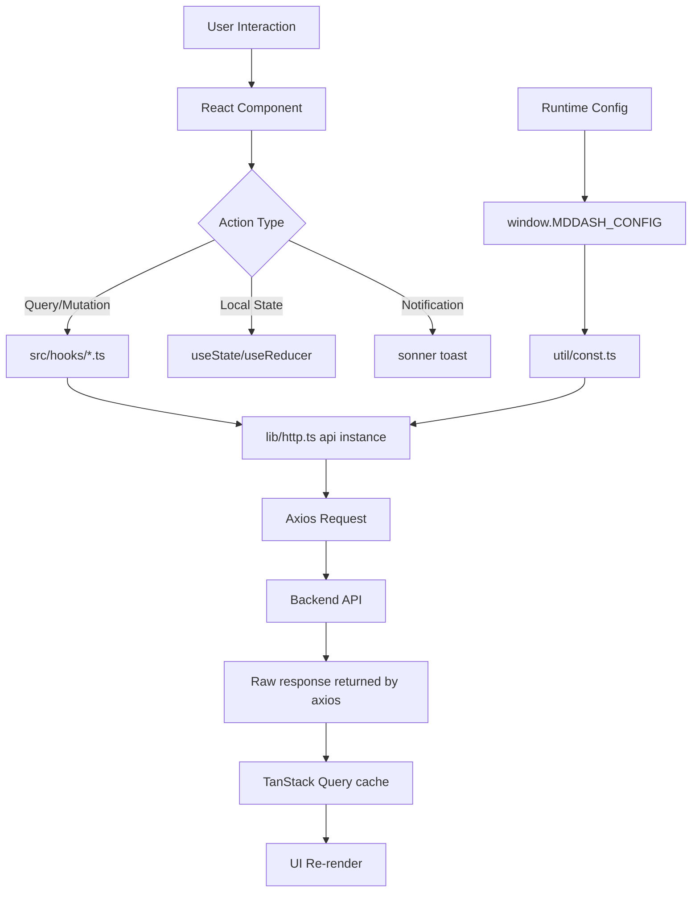

# MDDash UI

## Mission Statement

React-based web interface that provides a wizard-driven workflow for creating, configuring, and managing molecular dynamics experiments with real-time visualization and job monitoring.

## Architecture & Patterns

### Design Patterns
- **TanStack Query Pattern**: Server state managed via custom hooks with automatic polling; no manual `setInterval`/`useEffect` fetching
- **TanStack Router**: Manual route tree (`src/router.tsx`) with `basepath: BASE_PATH`; no file-based routing
- **Custom Hooks Pattern**: Domain hooks in `src/hooks/` encapsulate all data fetching and mutations
- **Stepper Pattern**: Linear wizard workflow with step validation and state progression
- **Provider Pattern**: Nested providers in `Main.tsx` — `ThemeProvider → QueryClientProvider → RouterProvider`
- **Component Composition**: Wizard steps as composable child components receiving shared props

### Layer Organization
```
pages/ → components/ → hooks/ → lib/http.ts → Backend API
   ↓         ↓
layouts/RootLayout → Header + Footer + Toaster
```

## Core Dependencies

| Library | Purpose | Critical Path |
|---------|---------|---------------|
| `react` | UI framework | Core component rendering |
| `@shadcn/ui` (via `radix-ui`) | Headless component primitives | All UI components (new-york style, zinc base) |
| `tailwindcss` v4 | Styling | All visual styles via CSS-first config |
| `lucide-react` | Icons | UI icons throughout the app |
| `@tanstack/react-router` | Routing | Navigation and URL management |
| `@tanstack/react-query` | Server state / data fetching | All API calls and polling |
| `axios` | HTTP client | Configured instance in `lib/http.ts` |
| `sonner` | Toast notifications | All user-facing notifications |
| `molstar` | 3D molecular visualization | Structure/trajectory rendering |
| `react-dropzone` | File uploads | Drag-and-drop file selection |

## Data Flow



### Request Lifecycle
1. User triggers action in component
2. Component calls a TanStack Query hook from `src/hooks/`
3. Hook's `queryFn` calls `api.get/post/patch/delete(path).then(r => r.data)` via `lib/http.ts`
4. Backend returns raw resources on success; axios error interceptor extracts `detail` field from `{detail: "..."}` error responses
5. TanStack Query updates its cache; components re-render automatically
6. Errors surface as thrown `Error` objects caught by query error state or `toast.error()`

### Background Operations
- Polling via TanStack Query `refetchInterval` option in hooks (e.g., metrics: 30s)
- MolStar plugin cleanup on unmount via `useEffect` cleanup function

## The "Gotchas"

### Runtime Configuration
- **Injected by Caddy**: `window.MDDASH_CONFIG` object injected via `config.js` in production
- **Dev mode detection**: `DEBUG` flag is `true` when `window.MDDASH_CONFIG` is undefined
- **Required paths**: `BASE_PATH` and `API_BASE` come from runtime config, not build time
- **Fallback values**: Dev defaults to `/dash/api` for `API_BASE`

### HTTP / API Client
- **Always use `lib/http.ts`**: Use the configured `api` axios instance, never raw `axios`
- **No wrapper functions**: Hooks call `api.get/post/patch/delete(path).then(r => r.data)` directly
- **Raw responses**: Backend returns resources directly — `r.data` is the payload (no envelope)
- **Errors thrown**: Failed requests throw `Error` with the backend `detail` field; handle in hook `onError` or toast

### ShadCN / Tailwind v4
- **CSS-first config**: Uses `@tailwindcss/vite` plugin; config lives in `src/index.css` via `@import "tailwindcss"` and `@theme` blocks
- **CSS variables**: All ShadCN theme values defined as CSS vars and exposed as Tailwind utilities via `@theme { --color-X: hsl(var(--X)); }`
- **Do NOT use `@apply`** with CSS var utilities (e.g., `border-border`) without ensuring the `@theme` registration is present
- **ShadCN Select sentinel**: `Select` requires non-empty string values; use `SELECT_NONE = "__none__"` (from `util/const.ts`) for "none" options

### Theme System
- **`ThemeProvider` in `src/Theme.tsx`**: Toggles `dark` class on `<html>`, persists to `localStorage`
- **FOUC prevention**: Initial mode applied synchronously at module init (`_initialMode`) before first render
- **Sonner integration**: `src/components/ui/sonner.tsx` reads `ThemeContext` instead of `next-themes`

### Notifications
- **Use `sonner` toast**: Call `toast.success()`, `toast.error()`, etc. directly — no context or hook needed
- **No custom notification context**: The old `NotificationContext` / `useNotification()` pattern is removed

### Wizard Workflow
- **Step persistence**: Experiment step stored in backend, not local state
- **Optimistic updates**: `WizardStepper` uses `queryClient.setQueryData` for immediate UI updates
- **`WizardStepperProps`**: Only accepts `{ experiment }` — there is no `setExperiment` prop
- **DEBUG mode**: Shows "DEBUG: next step" button when `DEBUG` is true

### MolStar Integration
- **Manual cleanup required**: Must call `plugin.dispose()` and `root.unmount()` on unmount
- **Mount ref management**: Uses `isMountedRef` to prevent state updates after unmount
- **Format resolution**: Use `resolveStructureFormat(filename)` and `resolveCoordsFormat(filename)` from `src/util/molstar-formats.ts` — maps file extensions to MolStar built-in format IDs (e.g. `.parm7` → `"prmtop"`, `.nc` → `"nctraj"`)
- **Unified loading**: `loadStructureWithCoordinates` handles both trajectory formats (PDB, GRO) and topology formats (PRMTOP, PSF, TOP) as structure sources via `plugin.dataFormats.get(format).parse()`
- **Supported structure formats**: PDB, GRO, mmCIF, PDBqt, XYZ, MOL, SDF, MOL2, PRMTOP/PARM7, PSF, TOP
- **Supported coordinates formats**: XTC, DCD, TRR, NC/NCTraj, LAMMPSTRJ

### File Operations
- **Dropzone component**: Use `Dropzone.tsx` for all file uploads
- **FormData**: File uploads use `FormData` with axios POST requests
- **File filtering**: Backend handles file extension filtering via `find_files()` API

### TypeScript Configuration
- **Path alias**: `@` maps to `./src` directory (configured in `vite.config.ts`)
- **Strict mode**: TypeScript strict mode enabled
- **Type definitions**: All API types defined in `util/types.ts`

## Entry Points

| File | Purpose | Key Functions |
|------|---------|---------------|
| `src/Main.tsx` | Application root, provider tree | `createRoot()`, provider nesting |
| `src/router.tsx` | TanStack Router manual route tree | Route definitions, `basepath` |
| `src/layouts/RootLayout.tsx` | Main layout | Header + Footer + Toaster + Outlet |
| `src/lib/http.ts` | Configured axios instance | `api` — all HTTP calls go through here |
| `src/lib/query-client.ts` | TanStack QueryClient | `staleTime: 30s`, `retry: 1`, no window focus refetch |
| `src/util/const.ts` | Runtime configuration | `BASE_PATH`, `API_BASE`, `DEBUG`, `SELECT_NONE` |
| `src/lib/status.ts` | Status badge utilities | `statusBadgeClass(variant)` |

### Page Entry Points
- `src/pages/Home.tsx` - Landing page with experiment list
- `src/pages/New.tsx` - Create new experiment form
- `src/pages/Wizard.tsx` - Main wizard workflow page

### Component Entry Points
- `src/components/Wizard/Stepper.tsx` - Wizard step navigation and state management
- `src/components/MolStar.tsx` - 3D molecular visualization component
- `src/components/Header.tsx` - Navigation header
- `src/components/Footer.tsx` - Page footer

### Hook Entry Points (`src/hooks/`)
- `use-experiments.ts` - Experiment list query
- `use-experiment.ts` - Single experiment query + mutations
- `use-metrics.ts` - Simulation metrics (refetchInterval: 30s)
- `use-notebook.ts` - Notebook status and control
- `use-simulations.ts` - Simulation manifest CRUD (list, get, create, update)
- `use-tuner.ts` - Tuner job integration (keyed by `simulation_path`)
- `use-gromacs.ts` - GROMACS job state (keyed by `simulation_path`)
- `use-amber.ts` - AMBER job state (keyed by `simulation_path`)
- `use-analysis.ts` - Analysis job state (submits `simulation_path`)
- `use-files.ts` - File listing query
- `use-mdrepo.ts` - MDRepo integration + `getMDRepoAuthUrl()`

### Wizard Step Entry Points
- `src/components/Wizard/SetupStep/SetupStep.tsx` - Setup, notebook spawning, and simulation manifest editing
- `src/components/Wizard/SimulationSelector.tsx` - Shared simulation list selector (used by all wizard steps)
- `src/components/Wizard/SimulationPreview.tsx` - Read-only simulation manifest preview with validation status
- `src/components/Wizard/SimulationEditor.tsx` - Create/edit simulation manifests in the setup step
- `src/components/Wizard/TuneStep/TuneStep.tsx` - Engine-specific parameter tuning workflow for GROMACS or AMBER
- `src/components/Wizard/RunStep/RunStep.tsx` - Engine-specific simulation execution for GROMACS or AMBER
- `src/components/Wizard/AnalyzeStep/AnalyzeStep.tsx` - Results analysis
- `src/components/Wizard/PublishStep/PublishStep.tsx` - MDRepo/MDPosit publication
