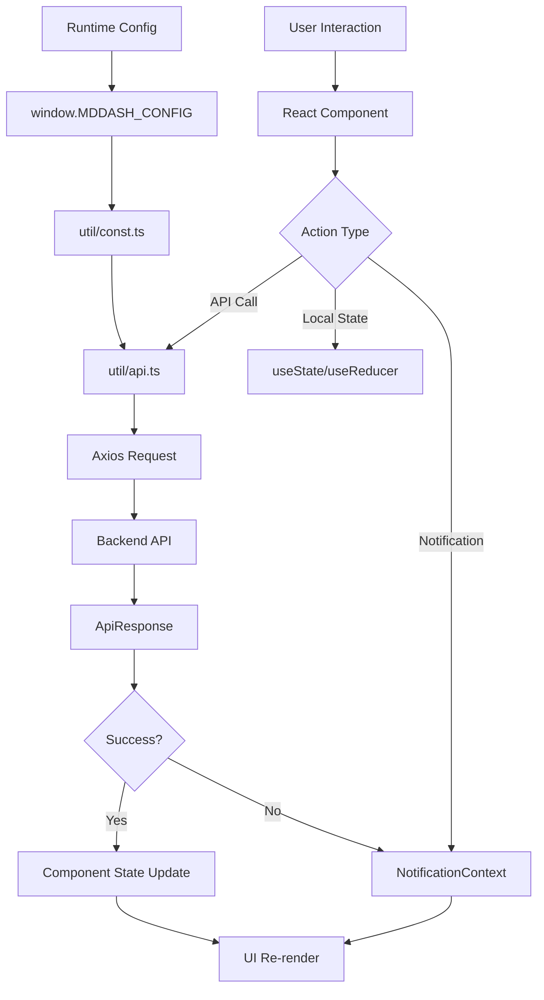

# MD Dash UI

## Mission Statement

React-based web interface that provides a wizard-driven workflow for creating, configuring, and managing molecular dynamics experiments with real-time visualization and job monitoring.

## Architecture & Patterns

### Design Patterns
- **Context API Pattern**: Global state management for Theme and Notifications without Redux
- **Custom Hooks Pattern**: `useNotification` and `useTheme` for encapsulated state logic
- **Stepper Pattern**: Linear wizard workflow with step validation and state progression
- **Provider Pattern**: Nested providers in Layout (ThemeProvider → NotificationProvider)
- **Repository Pattern**: Centralized API client in `util/api.ts` with consistent error handling
- **Component Composition**: Wizard steps as composable child components receiving shared props

### Layer Organization
```
pages/ → components/ → contexts/ → util/api.ts → Backend API
   ↓         ↓           ↓
Layout → ThemeProvider → NotificationProvider
```

## Core Dependencies

| Library | Purpose | Critical Path |
|---------|---------|---------------|
| `react` | UI framework | Core component rendering |
| `@mui/material` | Component library | All UI components |
| `@mui/icons-material` | Icons | UI icons throughout the app |
| `react-router-dom` | Routing | Navigation and URL management |
| `axios` | HTTP client | All API communication |
| `molstar` | 3D molecular visualization | Structure/trajectory rendering |
| `@emotion/react` | CSS-in-JS | Styled components |
| `react-dropzone` | File uploads | Drag-and-drop file selection |

## Data Flow



### Request Lifecycle
1. User triggers action in component
2. Component calls function from `util/api.ts`
3. Axios makes HTTP request to backend API
4. Response parsed via `handle_request()` wrapper
5. Returns `{ data, error }` object
6. Component updates state or shows notification via `useNotification()`
7. UI re-renders with new state

### Background Operations
- Wizard step polling: `setInterval` every 5 seconds in `WizardStepper`
- MolStar plugin cleanup on unmount via `useEffect` cleanup function
- Notification auto-dismiss after 5 seconds via `setTimeout`

## The "Gotchas"

### Runtime Configuration
- **Injected by Caddy**: `window.MDDASH_CONFIG` object injected via `config.js` in production
- **Dev mode detection**: `DEBUG` flag is `true` when `window.MDDASH_CONFIG` is undefined
- **Required paths**: `BASE_PATH` and `API_BASE` come from runtime config, not build time
- **Fallback values**: Dev defaults to `http://localhost:8888/api` for API_BASE

### API Client
- **Always use `util/api.ts`**: Do not make direct axios calls - use the centralized functions
- **Response structure**: All API functions return `{ data: T | null, error: string | null }`
- **Error handling**: Check `error` field first before accessing `data`
- **File downloads**: `get_file()` returns a `File` object, not JSON

### MolStar Integration
- **Manual cleanup required**: Must call `plugin.dispose()` and `root.unmount()` on unmount
- **Mount ref management**: Uses `isMountedRef` to prevent state updates after unmount
- **Binary format detection**: Automatically determines if format is binary based on file extension
- **Supported formats**: PDB, GRO, mmCIF for structures; XTC, DCD, TRR, NCTraj, Lammpstrj for trajectories

### Wizard Workflow
- **Step validation**: Can only navigate forward via `nextStep()`; backward navigation via `changeStep()`
- **Step polling**: Automatically polls backend every 5 seconds for step changes
- **Step persistence**: Experiment step stored in backend, not local state
- **DEBUG mode**: Shows "DEBUG: next step" button when `DEBUG` is true

### Notification System
- **Duplicate prevention**: Identical messages with same severity are not added
- **Auto-dismiss**: All notifications auto-dismiss after 5 seconds
- **Severity levels**: error, warning, info, success (mapped to MUI colors)
- **Always use hook**: Use `useNotification()` hook, never access Context directly

### Theme System
- **Context-based**: Uses ThemeContext with `mode` and `toggleTheme()`
- **MUI integration**: ThemeProvider wraps entire app for Material-UI theming
- **Dark mode support**: Uses `theme.applyStyles("dark", ...)` for dark mode styles

### File Operations
- **Dropzone component**: Use `Dropzone.tsx` for all file uploads
- **FormData**: File uploads use `FormData` with axios POST requests
- **File filtering**: Backend handles file extension filtering via `find_files()` API

### TypeScript Configuration
- **Path alias**: `@` maps to `./src` directory (configured in vite.config.ts)
- **Strict mode**: TypeScript strict mode enabled
- **Type definitions**: All API types defined in `util/types.ts`

## Entry Points

| File | Purpose | Key Functions |
|------|---------|---------------|
| `src/Main.tsx` | Application root with routing | `createRoot()`, route definitions |
| `src/Layout.tsx` | Main layout with providers | Provider nesting, Header/Footer |
| `src/util/api.ts` | Centralized API client | All backend API functions |
| `src/util/const.ts` | Runtime configuration | `BASE_PATH`, `API_BASE`, `DEBUG` |

### Page Entry Points
- `src/pages/Home.tsx` - Landing page with experiment list
- `src/pages/New.tsx` - Create new experiment form
- `src/pages/Wizard.tsx` - Main wizard workflow page

### Component Entry Points
- `src/components/Wizard/Stepper.tsx` - Wizard step navigation and state management
- `src/components/MolStar.tsx` - 3D molecular visualization component
- `src/components/Header.tsx` - Navigation header
- `src/components/Footer.tsx` - Page footer

### Context Entry Points
- `src/contexts/NotificationContext.tsx` - Notification state and methods
- `src/ThemeContext.ts` - Theme context definition
- `src/contexts/useNotification.ts` - Notification hook
- `src/useTheme.ts` - Theme hook

### Wizard Step Entry Points
- `src/components/Wizard/SetupStep/SetupStep.tsx` - Initial setup and notebook spawning
- `src/components/Wizard/TuneStep/TuneStep.tsx` - Parameter tuning workflow
- `src/components/Wizard/RunStep/RunStep.tsx` - GROMACS job execution
- `src/components/Wizard/AnalyzeStep/AnalyzeStep.tsx` - Results analysis
- `src/components/Wizard/PublishStep/PublishStep.tsx` - MDRepo publication
