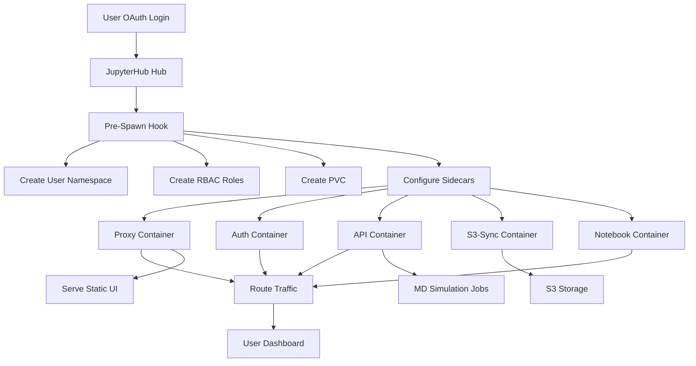

# AGENTS.md - helm/charts/mddash

## Mission Statement

Deploys a multi-tenant JupyterHub environment with MDDash for molecular dynamics simulations, providing isolated user namespaces with sidecar services for authentication, API access, and S3 synchronization.

## Architecture & Patterns

**Multi-Namespace Isolation Pattern**: Each user receives a dedicated Kubernetes namespace with resource quotas managed via Rancher project annotations. This provides strong isolation while enabling centralized management.

**Pre-Spawn Hook Pattern**: Uses JupyterHub's KubeSpawner pre_spawn_hook to dynamically provision user infrastructure (namespace, RBAC, PVC) before notebook startup. The hook executes asynchronously using `kubernetes_asyncio`.

**Sidecar Container Pattern**: Four sidecar containers run alongside the main notebook container:
- **proxy**: Caddy-based reverse proxy routing traffic to auth, API, and notebook services; also serves the complete static UI (compiled React/TypeScript dashboard)
- **auth**: Validates JupyterHub tokens and provides authentication middleware
- **api**: Flask backend for MD simulation management
- **s3-sync**: Background synchronization with S3-compatible storage

**Landing Page Deployment Pattern**: A separate Deployment, Service, and Ingress serves the public landing page at the root path (`pathType: Exact /`). It uses `vite-plugin-singlefile` to inline all assets, so no additional ingress rules are required for static assets.

**Template-Based Configuration**: Values file is a gomplate/Go template rendered with `gomplate` using external config YAML. This enables environment-specific deployments without maintaining duplicate values files.

## Core Dependencies

- **JupyterHub (4.2.0)**: Base platform with KubeSpawner for Kubernetes integration
- **kubernetes_asyncio**: Async Kubernetes API client for pre-spawn hook operations
- **gomplate**: Template engine for rendering values.yaml from values.yaml.tmpl
- **mdrun-api (0.1.0)**: Flask backend for MD simulation orchestration
- **gromacs-tuner (0.1.2)**: Ray-based hyperparameter tuning service
- **Caddy**: Reverse proxy and static file server for the UI

## Data Flow

## The "Gotchas" (Critical)

- **Values Template Rendering**: `values.yaml.tmpl` must be rendered with `gomplate` before Helm operations. From the repo root, use `make -C helm render`; from `helm/`, use `make render`. Never edit `values.yaml` directly—it's generated.

- **Pre-Spawn Hook Injection**: The hook file is injected via `--set-file jupyterhub.hub.extraConfig.pre-spawn-hook` during `helm install`/`upgrade`. The Makefile handles this automatically.

- **Proxy Serves Static UI**: The proxy container is not just a reverse proxy—it also serves the complete static UI (compiled React/TypeScript dashboard from `dashboard/ui/`). The UI is embedded as static assets within the proxy container image.

- **Rancher-Specific Annotations**: Namespaces require `field.cattle.io/projectId` and `field.cattle.io/resourceQuota` annotations for Rancher integration. The hook waits for `InitialRolesPopulated`, patches the namespace, then waits for ResourceQuota status to become active.

- **Custom Templates ConfigMap**: The `hub-templates` ConfigMap provides custom login/page templates. `make -C helm install` and `make -C helm deploy` create or update it through the `hub-templates` dependency.

- **Async Kubernetes Client**: The hook uses `kubernetes_asyncio` (not the synchronous `kubernetes` client). All API calls are async and must be awaited.

- **Security Context Hardening**: The `modify_pod_hook` applies security contexts to the notebook container for e-INFRA compliance. This includes dropping all capabilities and setting seccomp profiles.

- **Network Policies Disabled**: Both JupyterHub and singleuser pods have network policies disabled. This is intentional for the current deployment model.

- **Pre-Puller Disabled**: Image pre-pulling hooks are disabled due to resource limit constraints. Images are pulled on-demand during pod startup.

- **Cross-Namespace Hub Access**: The hook overrides `JUPYTERHUB_API_URL` to point to the hub namespace (`http://hub.{hub_namespace}.svc.cluster.local:8081/hub/api`) for cross-namespace communication.

- **Role Creation Order**: Roles must be created before RoleBindings. The hook uses `asyncio.gather` to create all Roles first, waits for them to exist, then creates RoleBindings.

- **Proxy Health Wait**: The proxy sidecar waits for `auth` `/health` and the dashboard API prefixed `/dash/api/health` endpoint with `curl --fail` before starting Caddy. Do not replace this with bare port checks; non-2xx responses must not count as readiness.

- **Landing Page Ingress Priority**: The landing page Ingress uses `pathType: Exact /` on the same host as JupyterHub. NGINX resolves Exact rules before Prefix rules, so the landing page owns only the root path while all other traffic continues to JupyterHub.

## Entry Points

- **`Chart.yaml`**: Defines the chart metadata, version, and dependencies (jupyterhub, mdrun-api, gromacs-tuner)
- **`values.yaml.tmpl`**: gomplate/Go template for configuration values; rendered to `values.yaml` by `gomplate`
- **`files/pre_spawn_hook.py`**: Main hook function `pre_spawn_hook()` that orchestrates user namespace creation, RBAC setup, and sidecar configuration
- **`templates/landing-page.yaml`**: Deployment, Service, and Ingress for the public landing page
- **`values.yaml.tmpl`** includes a `landing` section for image repository, tag, pull policy, and resource limits
