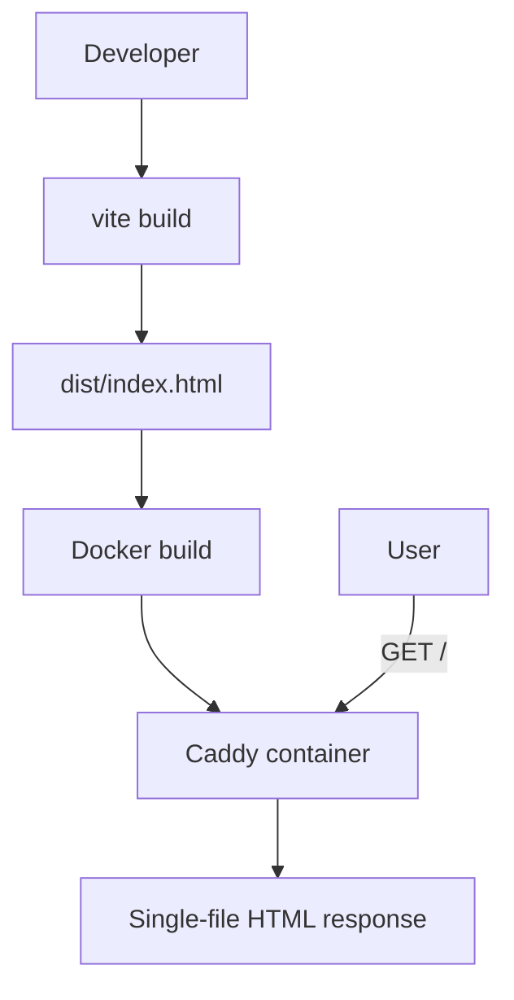

# Landing Page

## Mission Statement

Public landing page for MDDash — a React + TypeScript SPA served by Caddy at the root path (`/`). It introduces the platform and links users to the JupyterHub login at `/hub/`. No authentication required.

**Design system compliance is mandatory** for this component because it is the first point of contact for users. All visual elements, components, colors, and typography must use the e-INFRA design system.

## Architecture & Patterns

- **e-INFRA Design System**: All UI components, color tokens, typography, and layout primitives come from `@e-infra/design-system`. Custom CSS only extends the system; it never replaces it. This is mandatory for e-INFRA service identity and consistency.
  - Docs: https://design-system.e-infra.cz/docs
  - Source: https://github.com/CERIT-SC/design-system
- **Minimal React SPA**: Single-page application with no routing library or global state. Built with React, TypeScript, and Tailwind CSS v4.
- **Single-File Build**: `vite-plugin-singlefile` inlines all JS and CSS into a single `index.html`. No external asset requests are made, eliminating the need for additional ingress rules.
- **Static File Server**: Caddy serves the compiled `dist/` directory from `/srv` with `zstd`/`gzip` encoding. A `/health` endpoint returns `200 OK`.
- **Non-root Container**: Runtime image runs as UID 1000 with dropped capabilities, matching e-INFRA compliance requirements.

## Core Dependencies

| Library/Tool | Purpose |
|--------------|---------|
| `react` | UI framework |
| `typescript` | Type safety |
| `vite` | Build tooling |
| `@e-infra/design-system` | **Mandatory** e-INFRA design system — components, tokens, and theme |
| `tailwindcss` v4 | Styling (used by the design system and for layout utilities) |
| `vite-plugin-singlefile` | Inline all assets into one HTML file |
| `caddy` | Static file server and health endpoint |

## Data Flow

## The "Gotchas"

- **e-INFRA design system is mandatory**: All components must be imported from `@e-infra/design-system`. Do not replace tokens, override design-system CSS, or introduce arbitrary colors or fonts. If a required component or token does not exist, open an issue or PR in https://github.com/CERIT-SC/design-system rather than working around it.
- **Single-file output**: `vite-plugin-singlefile` embeds all scripts and styles as base64 data URIs. Do not expect separate `/assets/` paths in production.
- **Image optimization**: The custom `webpOptimize` Vite plugin converts PNG/JPEG imports to WebP base64 data URIs at build time.
- **Caddy is static only**: There is no auth, no proxy logic, and no runtime configuration in the landing page Caddyfile.
- **Ingress exact match**: The Helm chart deploys an Ingress with `pathType: Exact /` on the same host as JupyterHub. NGINX resolves Exact before Prefix, so only the root path is intercepted.

## Entry Points

| File | Purpose |
|------|---------|
| `src/main.tsx` | React entry point |
| `src/App.tsx` | Root component assembling all sections |
| `vite.config.ts` | Vite configuration with single-file plugin and WebP optimization |
| `Dockerfile` | Multi-stage build (Node → Caddy runtime) |
| `Caddyfile` | Static file server configuration on port 8080 |
| `Makefile` | Build and push orchestration for the landing page image |
