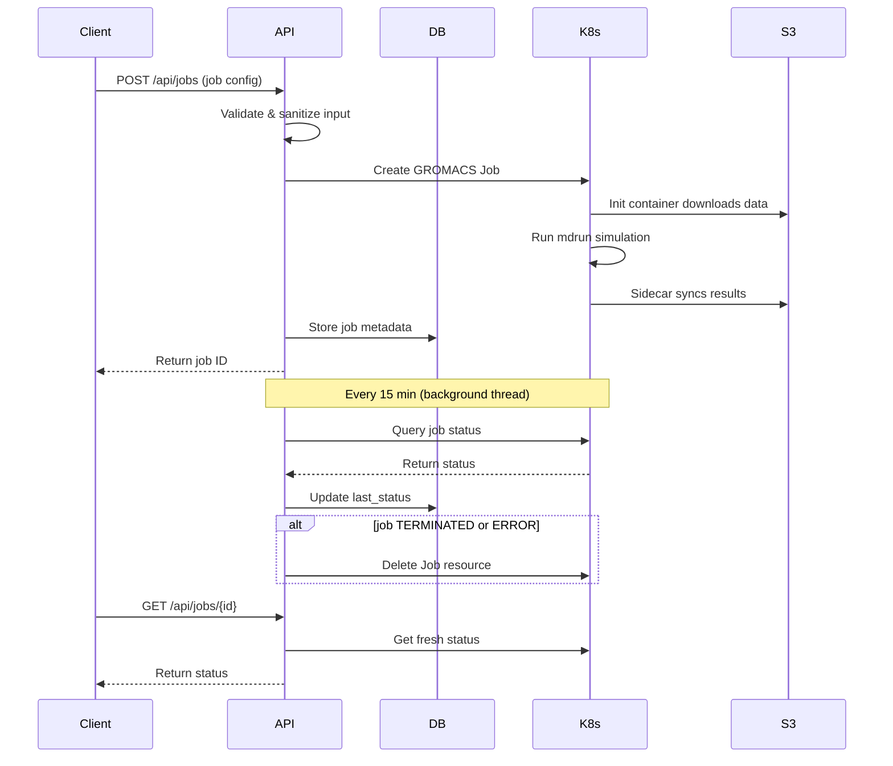

# MDRun API

## Mission Statement

Manage GROMACS molecular dynamics simulation jobs on Kubernetes with automated status tracking and S3 data synchronization.

## Architecture & Patterns

- **Flask Blueprint Pattern**: Routes organized into `health_bp` and `mdrun_bp` blueprints for modularity
- **Active Record Pattern**: `MdrunJob` model encapsulates both data persistence and Kubernetes orchestration logic
- **Background Polling**: Daemon thread periodically queries Kubernetes for job status updates (15-minute intervals)
- **Decorator Pattern**: `@handle_exceptions` provides centralized error handling with optional database rollback
- **Property-Based Status**: `MdrunJob.status` property dynamically fetches current status from Kubernetes and updates database

**Why these patterns**: The Active Record pattern simplifies job lifecycle management by coupling database records with Kubernetes resources. Background polling avoids webhook complexity while keeping status reasonably fresh.

## Core Dependencies

- **Flask**: Web framework and routing
- **SQLAlchemy**: ORM for job metadata persistence (SQLite with WAL mode)
- **Marshmallow**: Request validation and serialization
- **Kubernetes Python Client**: Direct Kubernetes Job manipulation (no operator pattern)
- **Flask-CORS**: Cross-origin request support

## Data Flow

## The "Gotchas" (Critical)

- **SQLite WAL Mode**: Database uses Write-Ahead Logging for concurrent reads/writes. Always use `db.session` within app context.
- **uWSGI Worker 1 Only**: Background polling thread only starts in `UWSGI_WORKER_ID=1` to prevent duplicate polling across workers.
- **On-Demand Status**: `MdrunJob.status` property queries Kubernetes on every access. Cache results if polling frequently.
- **Auto-Cleanup**: Jobs in TERMINATED or ERROR state are automatically deleted from Kubernetes but preserved in database.
- **Input Sanitization**: All user inputs MUST pass through `sanitization.py` functions to prevent shell injection in Kubernetes job manifests.
- **S3 Credentials Required**: `S3_ENDPOINT` must be set or API logs errors on startup.
- **GPU Type**: GPU resource type is read from the `GPU_TYPE` environment variable (set via `gpuType` in config.yaml). Defaults to empty string if unset.
- **K8s Config Loading**: Uses `config.load_incluster_config()` - assumes running inside Kubernetes cluster. For local dev, use `load_kube_config()`.
- **Job Naming**: Kubernetes jobs are named `mdrun-{uuid}`. Never manually create jobs with this prefix.
- **EmptyDir Size Limit**: Shared volume limited to 100Gi in `k8s_client.py`. Adjust for large simulations.

## Entry Points

- **`app.py`**: Flask application factory, database initialization, and polling thread startup
- **`routes.py`**: API endpoints (`GET /api/jobs/{id}`, `POST /api/jobs`, `DELETE /api/jobs/{id}`)
- *`models.py`**: `MdrunJob.create_and_start()` classmethod orchestrates job creation and Kubernetes submission
